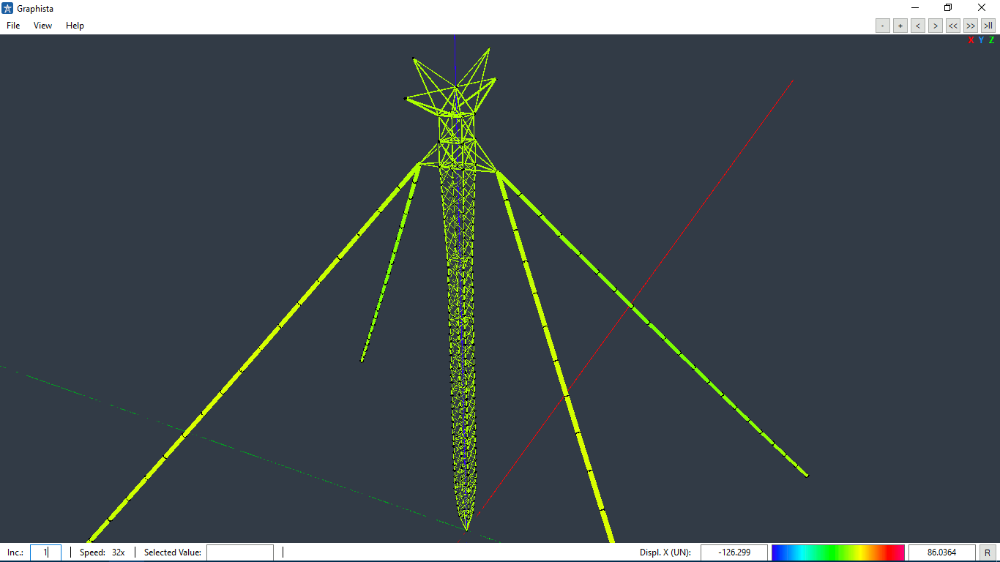

# Graphista

Graphista (or Graphical Structural Analysis) is a 3D graphic software for Structural Engineering.
It was developed for Windows using technologies such as: C#, C++, Windows Forms and OpenGL.
Its functionalities include the display of displacements, reactions, forces, strain and stress.

